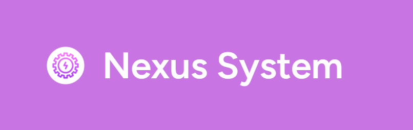
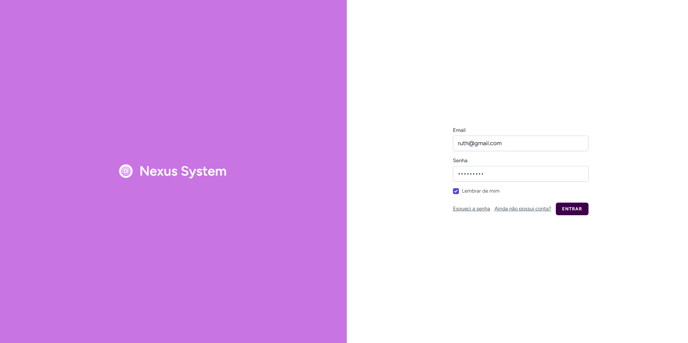
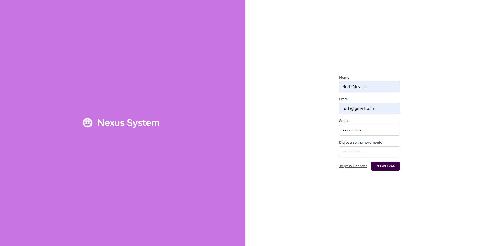
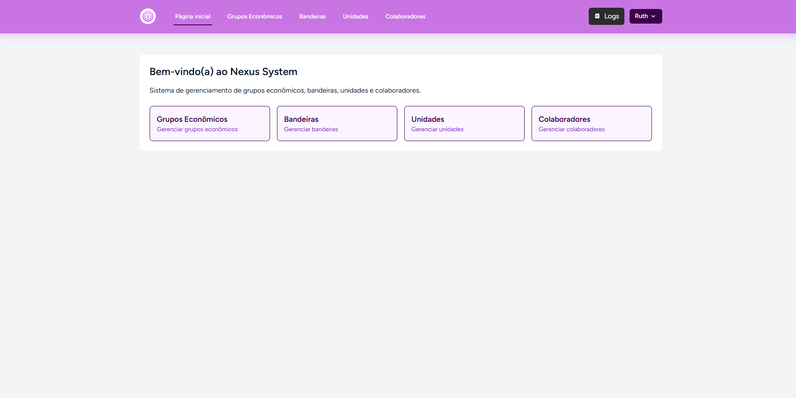
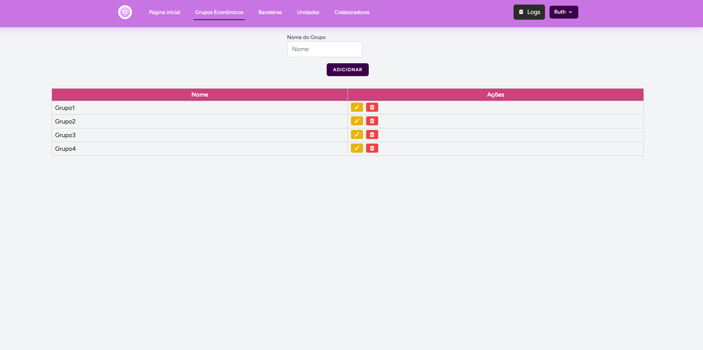
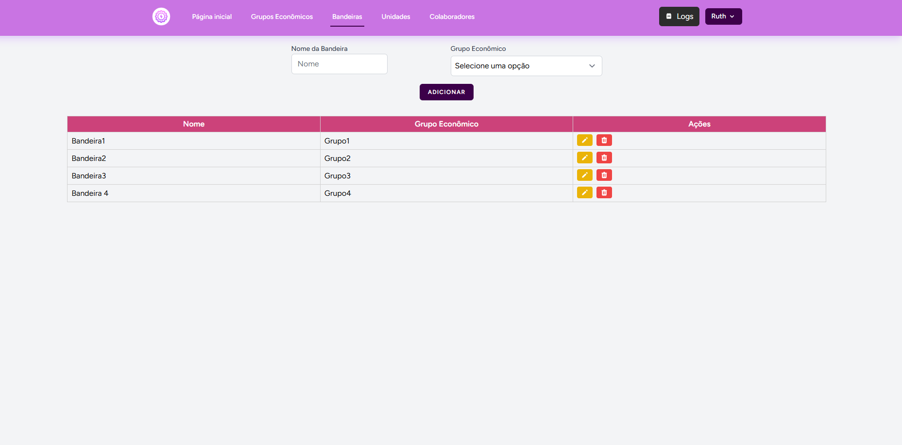
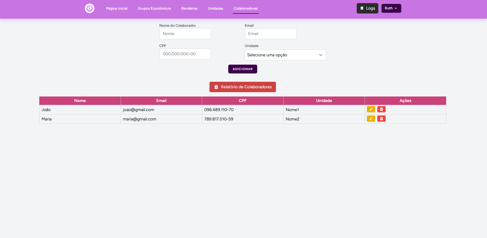
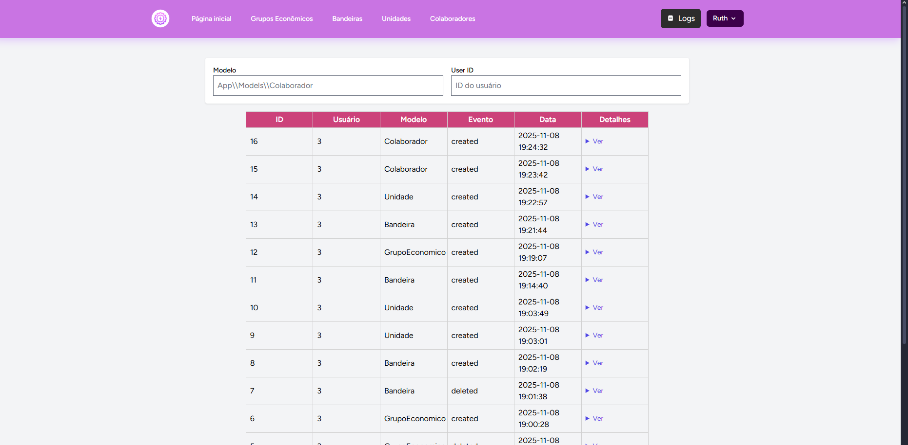

# Nexus System


Sistema de gerenciamento de grupos econômicos, bandeiras, unidades e colaboradores.

## Visão geral

Este repositório contém a aplicação "Nexus System" construída com Laravel, Livewire e Tailwind CSS. Inclui funcionalidades para CRUD de Grupos Econômicos, Bandeiras, Unidades e Colaboradores, além de exportação de relatórios e um sistema de auditoria.

### Tecnologias usadas:
-  PHP (>= 8.1)
- Livewire (v3+)
- Maatwebsite/Excel
- PHPUnit
- Tailwind CSS (+ @tailwindcss/forms)
- Laravel Breeze, Laravel Pint, Sail

## 📋 Pré-requisitos para instalação

- Docker (recomendado, usado pelo Laravel Sail)
- Git
- WSL (para utilização do terminal Ubuntu)

⚠️ Observação: se preferir não usar Sail, você ainda pode executar a aplicação localmente com PHP, Composer, MySql e Node instalados. As instruções abaixo assumem o uso do Laravel Sail (Docker).


## 🚀 Instalação
### ⚠️ Atenção: Utilizei o Larável Sail, portanto é recomendado que faça instalação use WSL

1. Clone o repositório:
```bash
git clone https://github.com/Ruthless-n/Nexus-system.git
cd Nexus-system
```

2. Copie o arquivo de ambiente e ajuste conforme necessário:
```bash
cp .env.example .env
```
3. Instalar as dependencias

```
compose install
```

## 🔧 Configuração


- Configure as credenciais do banco de dados no seu `.env`. Se estiver usando Sail, o MySQL container padrão é acessível com:
```
DB_CONNECTION=mysql
DB_HOST=mysql
DB_PORT=3306
DB_DATABASE=laravel
DB_USERNAME=sail
DB_PASSWORD=password
```

4. No seu terminal Ubuntu, localize o diretório do projeto.
```bash
cd /mnt/[caminho que voce clonou o arquivo]
```

Exemplo: (aqui no caso o projeto está no disco C)
```bash
cd /mnt/c/Nexus-system
```

5. instale dependências e inicie os containers Docker com Sail:
```bash
./vendor/bin/sail up -d --build
./vendor/bin/sail composer install
./vendor/bin/sail npm install
```

4. Gere a chave da aplicação e rode migrations:
```bash
./vendor/bin/sail artisan key:generate
./vendor/bin/sail artisan migrate --seed
```

6. Compile:
```bash
./vendor/bin/sail npm run dev

```

7. Acesse a aplicação em: http://localhost:8989 (ou o `APP_URL`, conforme configurado no `.env`)

## ⚙️ Comandos comuns via Sail

- Executar Testes:
```bash
./vendor/bin/sail artisan migrate
./vendor/bin/sail artisan db:seed
./vendor/bin/sail artisan test
```

- Rodar Tarefas em background (fila):
```bash
./vendor/bin/sail artisan queue:work
```


## 🎯 Uso

- Inicie/pare os containers:
```bash
./vendor/bin/sail up -d
./vendor/bin/sail down
```

- Acesse o painel em `http://localhost:8989` (ou `APP_URL`).

### Funcionalidades principais

- Grupos Econômicos: CRUD e listagem
- Bandeiras: CRUD e associação a grupos
- Unidades: CRUD, associação a bandeiras e exportação
- Colaboradores: CRUD, associação a unidades e exportação
- Relatórios exportáveis em Excel/CSV
- Auditoria (logs) — implementação backend disponível; visualização no front pode ser ativada/desativada pelo time

## 🧪 Testes

Executar o conjunto de testes com Sail:
```bash
./vendor/bin/sail artisan test
```

## 🛠️ Desenvolvimento e comandos úteis

```bash
# Rodar ambiente em modo desenvolvimento
./vendor/bin/sail up -d

# Instalar dependências
./vendor/bin/sail composer install
./vendor/bin/sail npm install

# Rodar migrations e seeders
./vendor/bin/sail artisan migrate --seed

# Compilar assets
./vendor/bin/sail npm run dev
./vendor/bin/sail npm run build

# Executar testes
./vendor/bin/sail artisan test

# Limpar cache
./vendor/bin/sail artisan cache:clear
./vendor/bin/sail artisan config:clear
./vendor/bin/sail artisan view:clear

# Criar link simbólico para storage
./vendor/bin/sail artisan storage:link
```

## 📦 Estrutura do projeto (resumida)

```
Nexus-system/
├── app/
├── config/
├── database/
├── resources/
├── routes/
└── tests/
```
## Capturas de tela do sistema

### Tela de Login


### Tela de Registro


### Página Inicial


### Grupos Econômicos


### Bandeiras


### Unidades


### Colaboradores


### Relatório de Colaboradores


### Auditoria


